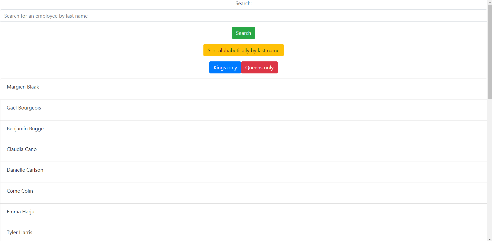
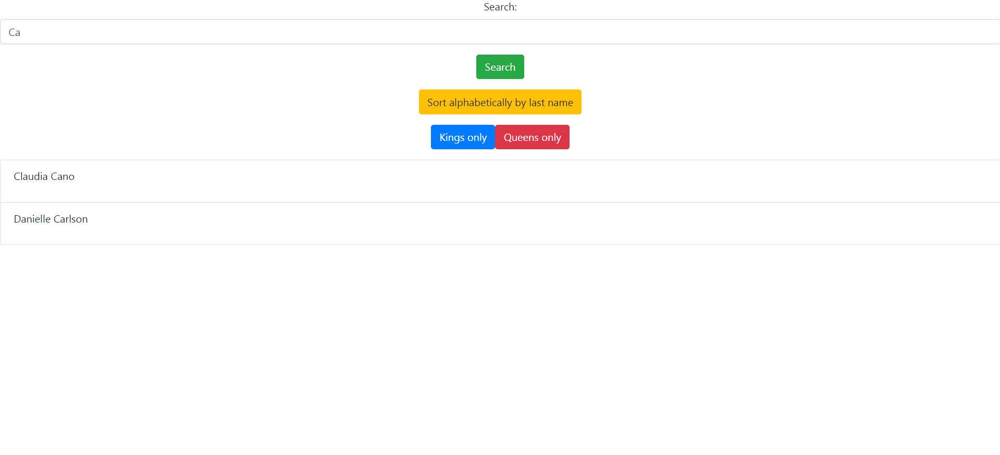

## employeeDirectory

## Table of Contents
1. [The Assignment](#the-assignment)
2. [Demonstration](#demonstration)
3. [Usage](#usage)
4. [Credits](#credits)
5. [Questions](#questions)

## The Assignment
Create a React app that allows the user to filter & sort a list of employees.

## Demonstration

## Usage

Simply follow this link to use the application.

https://dorrianweber.github.io/employeeDirectory/

## Credits

I was helped in this assignment by my TA Ryan Skog in our tutoring session, and by TA Zac Warner & instructor Alex Kaufmann during a homework help session.

## Questions

For any questions or comments, here is my contact information.
 
GitHub: https://github.com/dorrianweber
 
Email address: dorrianweber@gmail.com
